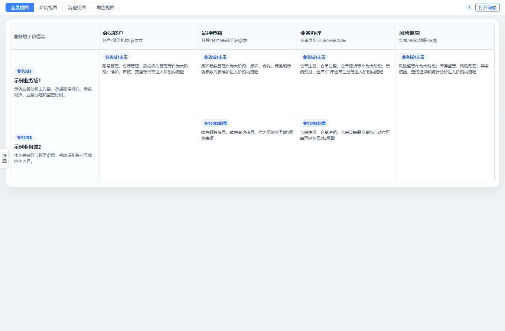
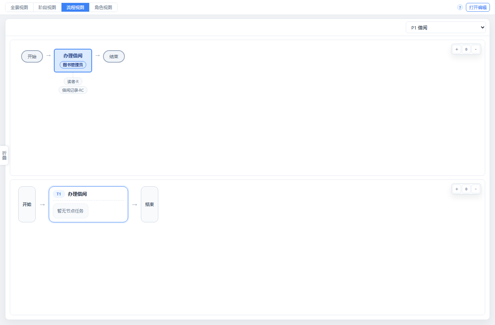
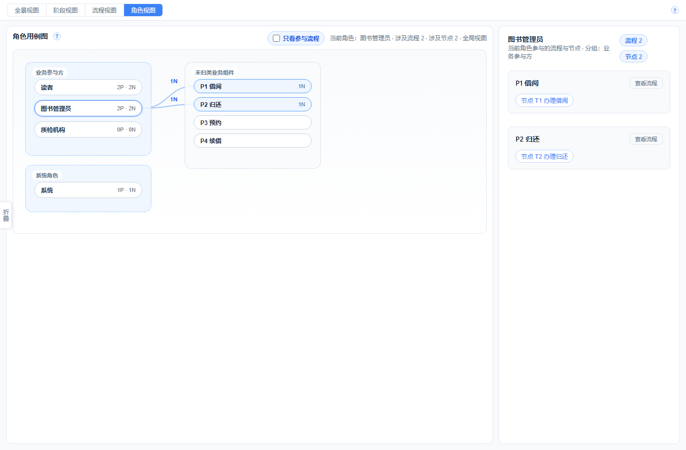
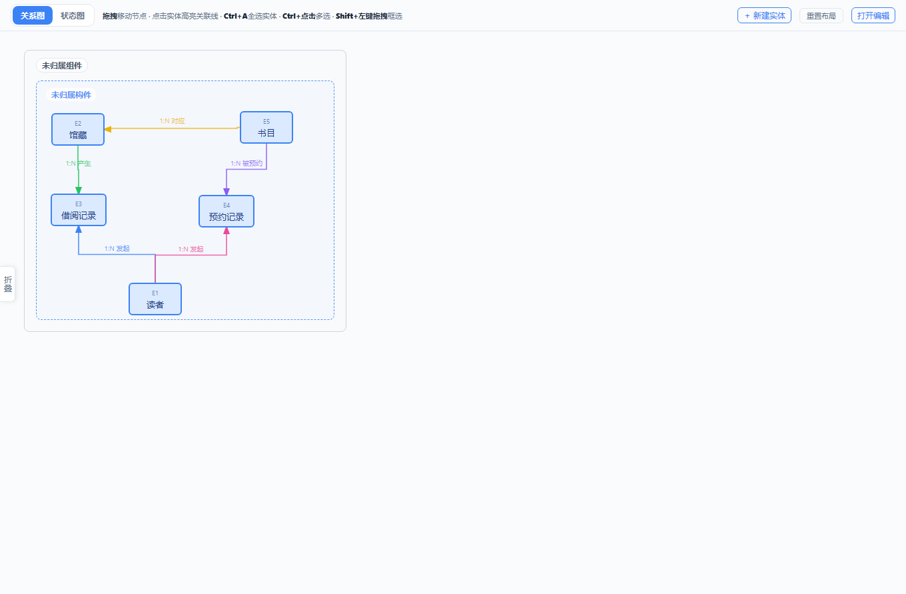
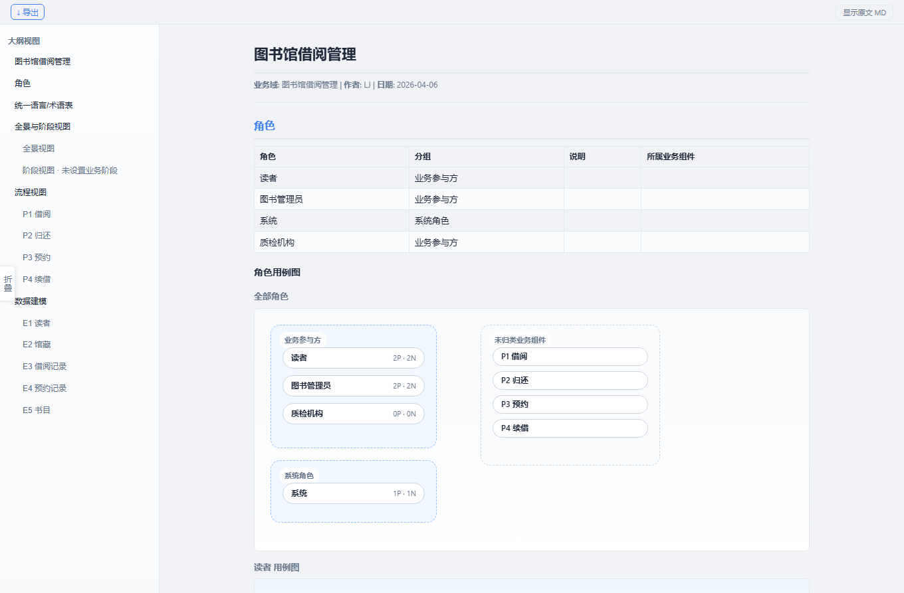

# BLM — 业务语言建模

> **Business Language Modeling**：用结构化的方式记录业务理解，告别 Word + Visio + Typora 反复切换。

---

## 项目结构

```text
blm/
├── blm.py              # 启动入口
├── blm_core/           # 后端核心：文档、存储、导出、HTTP 服务
├── app/                # 前端界面：状态、渲染、领域、流程、实体、预览
├── workspace/          # 本地文档目录（.json / .md）
├── tests/              # Python 单元测试与结构测试
└── tools/
    └── e2e/            # 可选的浏览器端到端测试工具链（Node + Playwright）
```

---

## 产品定位

BLM 是一个**本地优先、文件驱动、面向企业架构和流程落地的业务语言建模工具**。

- 企业架构视角：用“价值流 × 业务域”的全景视图，先说明业务活动在整盘业务里的位置。
- 流程落地视角：按“阶段 → 流程 → 流程节点 → 步骤/表单/实体/任务”逐层下钻，连接业务描述、原型和低代码实施。
- 资产治理视角：用业务组件沉淀可复用的实体、表单、任务、规则和术语，避免相同能力在不同产品里重复建设。
- 数据透明：文档直接存为本地 JSON / Markdown，不锁在平台里，便于审查、版本管理和二次加工。
- 轻量简单：运行时尽量只依赖 Python 标准库和静态前端，优先把单机建模体验做好。

---

## 什么是"业务结构化"

业务知识通常散落在需求文档、会议记录、口头描述、原型和系统实现中。BLM 的目标不是把这些内容重新写成文章，而是把它们放进同一套业务结构里：

```text
企业业务全景
├── 价值流（第 1 级，横轴）          → 企业有哪些大环节创造价值？
│   └── 业务域（第 2 级，纵轴）      → 哪些产品、业务线或责任边界需要分开比较？
│       └── 阶段（第 3 级）          → 某个价值流下有哪些稳定业务活动段？
│           └── 流程（第 4 级）      → 一个业务事项如何被发起、办理、办结？
│               └── 流程节点（第 5 级） → 某个角色在责任边界内连续做什么？
│                   ├── 步骤         → 用户如何查看、填写、选择、确认、提交？
│                   ├── 表单/片段    → 哪些信息需要被录入和展示？
│                   ├── 实体/字段    → 业务操作什么对象，最终落到哪些数据？
│                   └── 任务/规则    → 系统如何查询、校验、计算、变更和通知？
```

这套结构里，`价值流` 和 `业务域` 形成企业架构级的全景矩阵：横向看业务从哪里开始、经过哪些环节、如何形成结果；纵向看不同产品、业务线或监管对象在同一价值流下的相同点和差异点。

`业务组件` 不作为流程层级，而是资产治理口径。实体、表单、任务、规则、术语可以归属到业务组件，方便复用、对比和规范治理。

`角色` 与 `统一语言` 是横切视角：

- `角色`：从流程节点和任务上投影责任视图，回答“谁在办理、谁在使用这些流程模板”。
- `统一语言`：为价值流、业务域、流程、数据和规则提供统一命名，降低术语歧义。

**与工具中的落点对应如下**：

| 业务语义 | BLM 中的位置 |
|--------|-------------|
| 企业业务全景 | 全景视图：价值流 × 业务域 |
| 阶段和流程组织 | 阶段卡片、流程分组、流程图 |
| 责任边界和节点流转 | 流程节点、角色用例视图 |
| 用户操作和系统编排 | 步骤、编排任务、校验规则 |
| 数据对象和状态流转 | 实体、字段、实体关系图、实体状态图 |
| 资产复用和治理 | 业务组件、表单片段、实体组、规则归档 |

---

## 快速上手

**运行依赖**：Python 3.8+，无需安装 Node、npm 或额外第三方库

```bash
cd blm
python blm.py          # 启动本地服务，默认 http://0.0.0.0:8081
```

浏览器打开后：新建文档 → 全景视图确认价值流和业务域 → 下钻阶段、流程和节点 → 维护实体、表单、任务和规则 → 预览 / 导出 MD

---

## 测试说明

Python 测试直接在项目根目录执行：

```bash
python -m unittest discover -s tests -v
```

浏览器端到端测试是**可选工具链**，与运行主路径分离，放在 `tools/e2e/`：

```bash
cd tools/e2e
npm install
npm run install:browser
npm run test:e2e
```

如果想看到浏览器真实打开、慢速点击和输入，可使用演示模式：

```bash
cd tools/e2e
npm run test:e2e:demo
```

---

## 本地数据

- `ignore/` 是本地敏感数据目录，已在 `.gitignore` 中根目录锚定忽略，不能推送到 GitHub。
- `workspace/` 是本地建模工作区，默认不纳入版本管理。

---

## 功能演示 · 图书馆借阅管理

以下以「图书馆借阅管理」为例，展示 BLM 如何从企业全景下钻到流程、角色、实体和文档预览。

### 1. 企业业务全景

全景视图用二维矩阵表达业务位置：横轴是价值流，纵轴是业务域。图书馆案例中，价值流可以抽象为**会员客户、品种参数、业务办理、风险监管**，业务域用于区分不同服务对象、业务线或管理边界。



这个视图先回答“每个业务活动在整盘业务里的位置在哪里”。例如借阅、归还、预约、续借都属于业务办理价值流；读者管理、书目维护、馆藏管理更偏支撑和基础资料；超期提醒、违约限制、借阅额度则可以进入风险监管视角。

### 2. 流程和角色责任

从全景视图继续下钻，可以进入某个流程，查看节点、步骤、涉及实体和规则。角色用例视图则从责任角度反查：某个角色参与了哪些流程、承担哪些动作。





图书馆案例中的核心办理动作包括**借阅、归还、预约、续借**。其中“图书管理员”既可能办理借阅、归还，也可能处理预约、逾期、馆藏状态调整；“读者”更多发起查询、预约、续借等动作。流程图适合看业务如何运转，角色视图适合看责任如何分配。

### 3. 数据和实体关系

流程里的动作最终会落到实体、字段、状态和关系上。实体关系图用于把业务对象之间的结构讲清楚。



图书馆案例的核心实体包括：

| 实体 | 说明 |
|------|------|
| 读者 | 借阅主体，包含读者类型、账户状态、借阅额度等信息 |
| 书目 | ISBN 或书名层面的图书元信息 |
| 馆藏 | 一本可借阅的实体书，包含条码、馆藏状态、所属馆藏位置 |
| 借阅记录 | 一次借出到归还的完整流水 |
| 预约记录 | 馆藏不可借或需要排队时的预约信息 |

关系上通常体现为：`书目 1:N 馆藏`，`读者 1:N 借阅记录`，`读者 1:N 预约记录`，预约或借阅再关联具体馆藏。

### 4. 结构化预览和导出

预览页会把 JSON 文档渲染成面向阅读的业务报告，包含全景、流程、角色、实体、表单和规则等内容。后续导出 Markdown、生成原型、生成低代码配置，都可以基于这份结构化 JSON 继续派生。



---

## 让 LLM 自动生成 BLM JSON

这是 README 里最关键的一部分。**BLM 的规范输入输出是 JSON，而不是 Markdown**。  
Markdown、预览、后续原型设计、低代码编排，都是基于 JSON 再派生。

推荐工作流：

1. 给 LLM 一段固定的 system prompt
2. 把需求文档、会议纪要、访谈记录作为 user prompt 输入
3. 明确要求：**只输出合法 JSON，不要解释，不要包 markdown code fence**
4. 生成后直接导入 BLM，再人工补细节

### 推荐 system prompt

```text
你是一名业务建模专家，擅长从需求文档、访谈记录、业务描述中提取结构化的业务模型。
你使用的建模语言是 BLM（Business Language Modeling），输出标准 JSON 格式。

BLM 的核心不是写文章，而是沉淀结构化业务知识。请始终围绕以下原则建模：

1. 先识别六级模型：
   - 价值流：企业有哪些大环节创造价值
   - 业务域：哪些产品、业务线或责任边界需要分开比较
   - 阶段：某个价值流下有哪些稳定业务活动段
   - 流程：一个业务事项如何被发起、办理、办结
   - 流程节点：某个角色在责任边界内连续做什么
   - 步骤 / 表单 / 实体 / 任务：节点内部如何操作、交互、落数和执行

2. 业务组件不是流程层级，而是资产归属口径：
   - 用于沉淀可复用的实体、表单、任务、规则、术语
   - 用于比较不同业务域之间的共性能力和差异能力

3. 角色不是核心层级，而是流程节点/任务上的责任视角：
   - 角色词典用于统一命名、描述、分类
   - 任务通过 role_id 引用角色

4. 统一语言不是流程节点，而是术语词典：
   - 用于沉淀关键业务名词和定义

5. 输出必须是唯一合法 JSON：
   - 不要输出解释
   - 不要输出 markdown
   - 不要输出 ```json 代码块

6. 如果信息不足：
   - 可以留空字符串
   - 可以省略不确定字段
   - 不要编造业务细节
```

### 推荐 user prompt 模板

```text
请基于以下业务材料，输出一份完整的 BLM JSON。

要求：
1. 先给出价值流、业务域和阶段，再把流程放到对应阶段里
2. 流程按“可独立发起、独立跟踪、独立结束”的业务模板划分
3. 流程节点按“一个角色连续执行、不被其他角色打断”的粒度划分
4. 步骤要写清楚动作，不要只写笼统标题
5. roles 必须输出为对象数组，任务通过 role_id 引用
6. process 必须尽量补充 subDomain 和 stageId，entity 必须补充 group
7. 如果同一角色出现在多个流程中，复用同一个角色对象，不要重复创建
8. 只输出 JSON，不要解释

业务材料如下：
{{在这里粘贴需求文档/访谈纪要/业务描述}}
```

### 推荐 JSON 结构

下面这份结构就是当前 BLM 更推荐的导入格式。`roles` 已升级为对象数组，任务优先通过 `role_id` 关联：

```json
{
  "meta": {
    "domain": "业务域名称",
    "title": "文档标题",
    "author": "作者",
    "date": "YYYY-MM",
    "schema_version": 5,
    "modelLevels": [
      "价值流",
      "业务域",
      "阶段",
      "流程",
      "流程节点",
      "步骤+表单/任务+实体"
    ]
  },
  "panorama": {
    "columns": [
      { "id": "members", "name": "会员客户", "scope": "账号/读者/服务对象", "badge": "" },
      { "id": "catalog", "name": "品种参数", "scope": "书目/馆藏/分类参数", "badge": "" },
      { "id": "handling", "name": "业务办理", "scope": "借阅/归还/预约/续借", "badge": "" },
      { "id": "risk", "name": "风险监管", "scope": "超期/额度/异常处理", "badge": "" }
    ],
    "lanes": [
      { "id": "public-library", "name": "公共图书馆", "badge": "业务域", "note": "面向普通读者的馆藏借阅服务。" }
    ],
    "cells": [
      { "columnId": "handling", "laneId": "public-library", "status": "主责", "text": "借阅、归还、预约、续借等阶段和流程。" }
    ]
  },
  "stages": [
    {
      "id": "S1",
      "name": "借阅办理",
      "subDomain": "公共图书馆",
      "panoramaColumnId": "handling",
      "panoramaLaneId": "public-library",
      "processLinks": []
    }
  ],
  "roles": [
    {
      "id": "R1",
      "name": "图书管理员",
      "desc": "负责借阅办理、归还确认、预约处理和馆藏状态维护。",
      "group": "馆内服务人员",
      "subDomains": ["公共图书馆"]
    }
  ],
  "language": [
    { "term": "馆藏", "definition": "一本可被借阅、盘点和定位的实体书。" }
  ],
  "processes": [
    {
      "id": "P1",
      "name": "借阅办理",
      "subDomain": "公共图书馆",
      "stageId": "S1",
      "trigger": "读者到馆或线上选择可借馆藏",
      "outcome": "馆藏借出并生成借阅记录",
      "nodes": [
        {
          "id": "N1",
          "name": "确认借阅",
          "role_id": "R1",
          "role": "图书管理员",
          "repeatable": false,
          "userSteps": [
            { "name": "扫描读者证件", "type": "Query", "note": "查询读者账户状态和当前在借数量" },
            { "name": "扫描馆藏条码", "type": "Query", "note": "确认馆藏可借" },
            { "name": "提交借阅登记", "type": "Fill", "note": "生成借阅记录并更新馆藏状态" }
          ],
          "forms": [
            {
              "id": "F1",
              "name": "借阅登记",
              "purpose": "记录读者、馆藏和应还日期",
              "sections": [
                {
                  "id": "SEC1",
                  "name": "读者信息",
                  "entity_id": "E1",
                  "fields": [
                    { "name": "读者编号", "type": "Readonly", "required": true, "entity_field": "读者编号", "note": "" }
                  ]
                },
                {
                  "id": "SEC2",
                  "name": "借阅信息",
                  "entity_id": "E3",
                  "fields": [
                    { "name": "应还日期", "type": "Date", "required": true, "entity_field": "应还日期", "note": "默认借出日期 + 30 天" }
                  ]
                }
              ]
            }
          ],
          "orchestrationTasks": [
            { "name": "校验借阅资格", "type": "Check", "target": "读者", "note": "账户正常且未超过借阅上限" },
            { "name": "更新馆藏状态", "type": "Mutate", "target": "馆藏", "note": "状态由可借改为已借出" }
          ],
          "entity_ops": [
            { "entity_id": "E1", "ops": ["R"] },
            { "entity_id": "E2", "ops": ["R", "U"] },
            { "entity_id": "E3", "ops": ["C"] }
          ],
          "rules_note": "存在超期记录或超过借阅上限时不得继续借阅。"
        }
      ]
    }
  ],
  "entities": [
    {
      "id": "E1",
      "name": "读者",
      "group": "会员客户",
      "note": "记录读者身份、类型、账户状态和借阅额度。",
      "fields": [
        { "name": "读者编号", "type": "id", "is_key": true, "is_status": false, "note": "" },
        { "name": "账户状态", "type": "enum", "is_key": false, "is_status": true, "note": "正常/冻结/注销" }
      ]
    },
    {
      "id": "E2",
      "name": "馆藏",
      "group": "品种参数",
      "note": "记录实体书条码、所属书目、馆藏位置和可借状态。",
      "fields": [
        { "name": "馆藏条码", "type": "id", "is_key": true, "is_status": false, "note": "" },
        { "name": "馆藏状态", "type": "enum", "is_key": false, "is_status": true, "note": "可借/已借出/预约锁定/维修下架" }
      ]
    },
    {
      "id": "E3",
      "name": "借阅记录",
      "group": "业务办理",
      "note": "记录一次借出到归还的完整流水。",
      "fields": [
        { "name": "借阅编号", "type": "id", "is_key": true, "is_status": false, "note": "" },
        { "name": "借阅状态", "type": "enum", "is_key": false, "is_status": true, "note": "借阅中/已归还/已逾期" }
      ]
    }
  ],
  "relations": [
    { "from": "E1", "to": "E3", "type": "1:N", "label": "读者产生借阅记录" },
    { "from": "E2", "to": "E3", "type": "1:N", "label": "馆藏形成借阅流水" }
  ],
  "rules": [
    {
      "name": "借阅资格校验规则",
      "type": "DataRule",
      "applies_to": "E1",
      "description": "读者账户必须正常，且当前在借数量不能超过读者类型对应上限。",
      "formula": ""
    }
  ]
}
```

### 生成质量检查清单

把这段再附在 prompt 末尾，通常能让结果更稳：

```text
请在输出前自行检查：
1. panorama.columns 是否表达价值流，panorama.lanes 是否表达业务域
2. 所有阶段、流程、流程节点、实体 ID 是否唯一
3. process.stageId 是否能在 stages 中找到
4. node.role_id 是否能在 roles 中找到
5. process.subDomain、entity.group 是否尽量补齐
6. userSteps.type 和 orchestrationTasks.type 是否只使用 Query / Check / Fill / Select / Compute / Mutate 或明确的自定义类型
7. forms.sections.entity_id、entity_ops.entity_id 是否都能在 entities 中找到
8. 不要把页面按钮、技术表、日志表当成业务实体
9. 不要输出注释，不要输出解释，只输出 JSON
```

### 建模注意事项

1. ID 命名：阶段用 `S1/S2...`，流程用 `P1/P2...`，节点用 `N1/N2...`，实体用 `E1/E2...`，角色用 `R1/R2...`
2. 价值流粒度：优先覆盖企业主线、支撑和监管活动，不要退化成每个页面一个价值流
3. 业务域粒度：用于比较产品、业务线或责任边界的共性和差异，不等同于系统模块
4. 阶段粒度：一个阶段可以容纳多个流程，用来表达某个价值流下的稳定业务活动段
5. 流程粒度：一个流程 = 一个可独立发起、独立跟踪、独立结束的业务模板
6. 节点粒度：一个节点 = 一个角色连续执行、不被其他角色打断的一组动作
7. 步骤粒度：一步 = 一个明确动作，最好能直接支撑原型和低代码编排
8. 实体粒度：只建模业务核心实体，不把配置表、日志表、缓存表塞进去
9. 角色粒度：优先统一命名，不要同时出现“管理员 / 经办人 / 操作员”这种近义重复
10. 不确定的信息：留空，不编造

---

## 后续规划

```
BLM（本工具）
    ↓ 导出 JSON
DDD_Agent（大模型 + 建模规则）
    → 生成限界上下文、聚合、领域事件
    ↓
BDD_Agent（大模型 + 测试规则）
    → 生成 Gherkin 场景、验收测试
```
