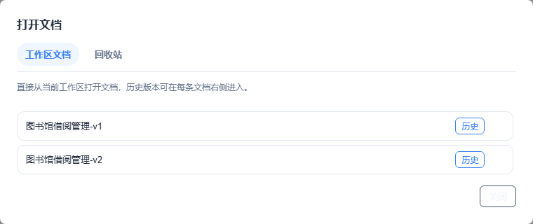
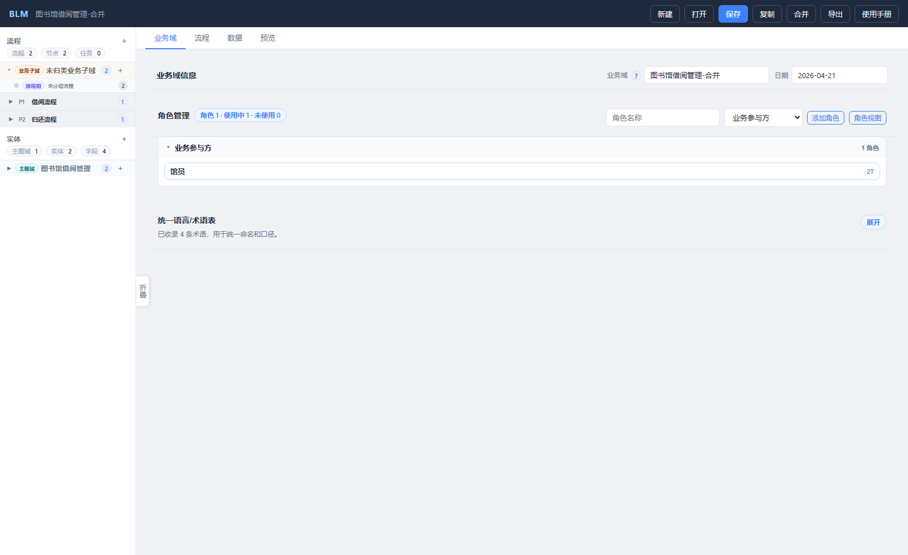

# BLM用户手册

## 1. 适用范围

本文档面向当前浏览器版 BLM 用户，说明如何在同一个工作区中完成文档建模、保存、复制、合并、恢复，以及查看内置使用手册。

## 2. 启动方式

在项目根目录执行：

```bash
python blm.py
```

启动后在浏览器中打开本地地址，例如：

```text
http://0.0.0.0:8081
```

## 3. 主界面说明

顶部工具栏包含以下按钮：

- 新建
- 打开
- 保存
- 复制
- 合并
- 导出
- 使用手册

左侧为工作区导航，右侧为建模编辑区与预览区。


### 3.1 左侧目录怎么看

流程区顶部会展示三个统计口径：

- 流程：当前文档里的流程数量
- 节点：所有流程下的节点数量
- 任务：所有节点下的编排任务数量

其中“任务”默认指编排任务，用来体现研发实现工作量；用户操作步骤不纳入这里的统计。

### 3.2 使用手册入口

1. 点击顶部工具栏里“导出”后面的“使用手册”按钮。
2. 页面会直接打开内置的用户手册。
3. 左侧目录按一级标题分组展示，二级目录默认折叠，点击可展开阅读。
4. 点击目录项后，正文会自动滚动到对应位置。

补充说明：

- 使用手册是独立阅读态，不显示“业务域 / 流程 / 数据 / 预览”这排建模页签。
- 左侧只保留目录，不再显示多文档切换列表。
- 正文中的截图会和文档内容一起渲染。


## 4. 工作区文档操作

### 4.1 新建文档

1. 点击“新建”。
2. 输入文档名称。
3. 点击“创建”。

创建后系统会在当前工作区生成文档，并自动进入编辑状态。

### 4.2 打开文档

1. 点击“打开”。
2. 在“工作区文档”页签中选择目标文档。
3. 点击文档条目即可打开。

打开弹窗包含两个页签：

- 工作区文档
- 回收站

在工作区列表中，每个文档条目右侧还提供：

- 历史：查看该文档的历史快照
- 删除：将文档放入回收站



### 4.3 保存

- 点击“保存”会保存当前文档。
- 如果业务域名称被修改，系统会按新的名称保存工作区文档。
- 若目标名称已存在，会提示是否覆盖同名文档。

### 4.4 复制

“复制文档”用于基于当前内容创建一个新的工作区文档。

1. 点击“复制”。
2. 输入一个新的文档名称。
3. 点击“确认复制”。

复制不是“另存到其他目录”，而是在当前工作区复制出一个新文档，因此复制名称必须唯一。

## 5. 流程建模

### 5.1 流程层级

BLM 当前按 6 级模型理解流程：

- 价值流
- 业务域
- 阶段
- 流程
- 流程节点
- 步骤 + 表单/任务 + 实体

流程工作台左侧提供“业务流程 / 业务组件”两种阅读方式。业务流程视角按价值流、阶段、流程、节点逐层展开；业务组件视角用于查看实体、任务和关联流程。左侧业务域筛选项以全景视图纵轴为准，旧的业务域字段只作为兼容别名参与筛选。

### 5.2 流程工作台视图

流程 Tab 顶部提供四个视图：

- 全景视图：查看并编辑价值流矩阵。横轴价值流、纵轴业务域或产品边界、单元格说明都来自文档中的“全景表格”；“打开编辑 / 关闭编辑”固定在顶部视图工具栏，说明收纳到问号提示中且不会被页面容器遮挡。进入编辑后可直接在矩阵中维护行列、标签、备注和阶段卡片，编辑框会显示字段提示。新增行列默认正文为空，删除正文后也不会自动回填示例值。默认示例全景以“示例平台2期”为主行，“示例仓单系统”为职责参照行；默认价值流为“会员客户、品种参数、业务办理、风险监管”，其中入库、在库、出库统一收敛到“业务办理”。阶段卡片保持粗粒度，示例为账号管理、仓库管理、质检机构管理、品种参数管理、仓单注册、仓单流转、风险监管；示例预报、仓库/厂库仓单注册等细节放在阶段内部流程。全景阅读态会把仓库主体维护、仓库资质维护、仓房维护、垛位维护、提货地点与点位聚合为“仓库管理”，避免单元格堆出过多细阶段。阶段卡片按行列槽位对齐，横向摆放表示大致先后，纵向摆放表示并列或无严格先后；表格较大时可滚动并缩放查看。
- 阶段视图：查看某个阶段内部引用了哪些流程，以及阶段内流程连线。
- 流程视图：默认以业务指引图展示单个流程，蓝色竖排节点按办理顺序向右展开；点击节点后进入该节点的用户步骤、资料、规则和编排任务编辑。
- 角色视图：作为责任过滤视图，按当前角色查看其参与的流程和任务。

阶段视图中的流程节点表示该阶段涉及的业务流程。同一个流程涉及多个阶段时，节点会提示涉及阶段数量；进入流程详情后，也可以看到该流程涉及哪些业务阶段。

### 5.3 节点、用户操作步骤、编排任务

流程内部的主要建模对象包括：

- 节点：业务级的关键处理单元
- 用户操作步骤：面向产品和业务人员，描述页面上的查看、点击、填写、提交等动作
- 编排任务：面向研发人员，描述查询、校验、计算、服务调用、数据变更等实现任务

用户操作步骤与编排任务是两个平行视角，不要求一一对应。

### 5.4 节点编辑

进入节点后，页面会展示：

- 节点基本信息
- 用户步骤视图 / 任务级视图切换
- 用户操作步骤
- 编排任务
- 涉及实体
- 业务规则

其中：

- 产品经理通常重点维护“节点”和“用户操作步骤”
- 研发人员通常重点维护“编排任务”

### 5.5 用户操作步骤

用户操作步骤支持：

- 在任一步骤后直接插入新步骤
- 上移、下移调整顺序
- 为每一步设置类型
- 按需添加、修改和保存备注/规则

没有备注时，页面只显示“＋备注/规则”按钮，不会露出空白备注框。备注内容按纯文本保存，可以换行，也可以粘贴普通链接；目前不会把 `#` 等符号渲染成 Markdown 标题，也不支持直接上传图片。这样即使步骤很多，也不需要每次都滚到顶部再新增。

### 5.6 编排任务

编排任务不再使用三级抽屉，而是在当前节点编辑区内直接维护。  
每个编排任务支持：

- 维护名称、类型、目标
- 查询类任务设置查询来源
- 记录输入输出、前置条件和异常处理备注
- 行内插入、上下调整顺序、删除
- 备注默认收起，需要时再添加或修改

同时页面会展示“任务级流程图”：

- 多个编排任务按串行顺序排列
- 外层用节点框表示当前节点上下文
- 便于研发从节点视角继续下钻到实现视角
- 当切换到“任务级视图”时，顶部流程图会同步切换成“全流程任务级视图”
- 全流程任务级视图会按整个流程串起所有节点，并在每个节点框内展示该节点下的编排任务链路
- 点击全流程任务级视图中的节点框，可以直接切换当前编辑节点

### 5.7 表单模型

表单模型挂在流程节点下，用来表达当前节点要展示或填写的界面内容。一个表单可以包含多个分组，每个分组下维护字段。

表单编辑支持：

- 新增、删除表单
- 分组的行内插入、删除、上移、下移
- 字段的行内插入、删除、上移、下移
- 字段类型、必填、实体字段映射和说明维护

这里的“分组”仍然可以作为后续表单片段复用的来源。整张表单仍然属于具体节点，适合复用的是分组和字段定义；当前左侧业务组件目录先不展示表单片段，避免目录过重。

### 5.8 业务组件资产

业务组件视角里的任务是可点击资产，关联流程来自使用这些任务的流程：

- 实体显示在业务组件下，不再在左侧底部另起一棵实体目录树
- 任务来自流程节点中的编排任务，并全部展开展示
- 关联流程来自任务的来源流程
- 点击实体会进入数据页的实体详情
- 点击任务会进入来源节点的任务级视图

这一步先解决“资产能看见、能回到来源”的问题。后续可以继续支持在编排任务或表单设计时复用已有任务、表单片段和字段定义。

数据页里的“实体组”用于关系图分组和着色，通常可以和业务组件保持一致；当一个组件下实体很多时，也可以细分成入库预约、在库流转、货转等更小的实体标签。

## 6. 合并文档

### 6.1 适用场景

适合两个人在同一工作区里分别维护两个文档，定期把它们合成一个新文档。

### 6.2 操作步骤

1. 点击“合并”。
2. 在左侧文档、右侧文档两个下拉框中选择要合并的工作区文档。
3. 点击“确认合并”。

系统行为如下：

- 如果没有冲突，会直接生成一个新的合并文档。
- 如果存在冲突，会先展示冲突项。
- 处理完所有冲突后，再次点击“确认合并”即可完成。


### 6.3 合并结果

- 合并结果默认以新文档形式保存到工作区。
- 合并后的文档标题与业务域名称会保持一致。



## 7. 回收站与历史版本

### 7.1 历史版本

- 每次覆盖保存前，系统会自动保留旧版本快照。
- 点击“打开”后，在工作区文档条目的“历史”按钮中查看。
- 恢复历史版本前，系统会先为当前版本再保留一个快照。

### 7.2 回收站

- 删除文档时不会直接物理删除，而是进入回收站。
- 点击“打开”，切换到“回收站”页签可查看。
- 点击“恢复”后，文档会回到工作区。

## 8. 导出

点击“导出”后，系统会导出两类文件：

- 当前文档 JSON
- 当前文档 Markdown

其中 Markdown 内容来自当前文档结构化数据的派生结果。

## 9. 常见问题

### 9.1 点击“合并”没有反应怎么办？

- 先刷新页面，确保浏览器拿到最新前端代码。
- 确认工作区中至少存在两个文档。
- 如果仍有问题，查看浏览器控制台是否有前端报错。

### 9.2 使用手册没有加载出来怎么办？

- 如果进入“使用手册”后看到“当前服务版本过旧，请重启 BLM 服务”的提示，通常表示浏览器页面已经更新，但本地 Python 服务还是旧版本。

## 8. 实时协作与弱网排障

### 8.1 立即同步

- 顶栏“立即同步”用于把自己的修改推送到服务端，同时拉取并合并他人的修改。
- 正常情况下系统会自动同步，用户不需要频繁点击。
- 如果顶栏显示“有更新待同步”，点击“立即同步”即可完成推送和拉取。
- 如果协作连接中断，页面会尝试重连；恢复前不要关闭页面，本地修改仍保留在当前浏览器内存中。

### 8.2 协作诊断

- 点击顶栏“协作在线”状态，可以打开“协作连接诊断”。
- 诊断信息包含当前文档、连接状态、seq、在线用户、待同步状态和最近同步时间。
- 网络异常时，可以复制诊断信息发给管理员排查。

### 8.3 管理端

只读管理端默认随主服务启动，默认端口是 `8091`：

```powershell
python blm.py
```

打开 `http://服务器地址:8091` 后，可以查看：

- 服务运行状态、主服务端口、工作区路径。
- 当前协作会话、在线用户和文档 seq。
- 最近结构化日志。
- 诊断包下载入口。

日志默认位于 `workspace/.logs/`。排查跨网段断线时，优先收集 `blm.log`、`errors.log` 和管理端诊断包。

更完整的日志字段、HTTP 降级机制和排查步骤，请查看内置文档《协作与弱网排障指南》。
- 关闭旧的 `blm.py` 进程后重新启动，再刷新浏览器页面即可。

### 9.3 为什么删除后文档还能找回？

因为系统默认启用了回收站，删除操作是“移入回收站”，不是直接彻底删除。

### 9.4 为什么保存前旧内容还能恢复？

因为系统会在覆盖保存前自动生成历史快照，用于误改、误覆盖后的恢复。
