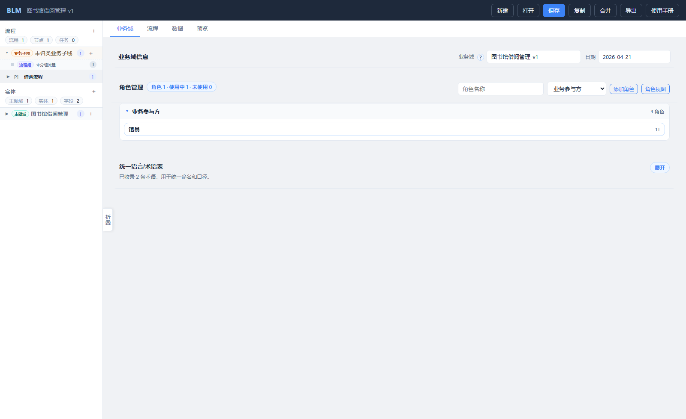
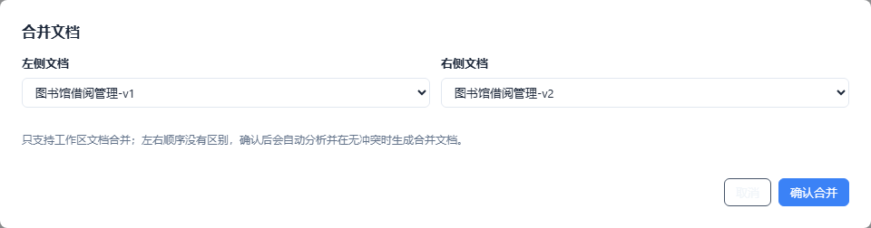
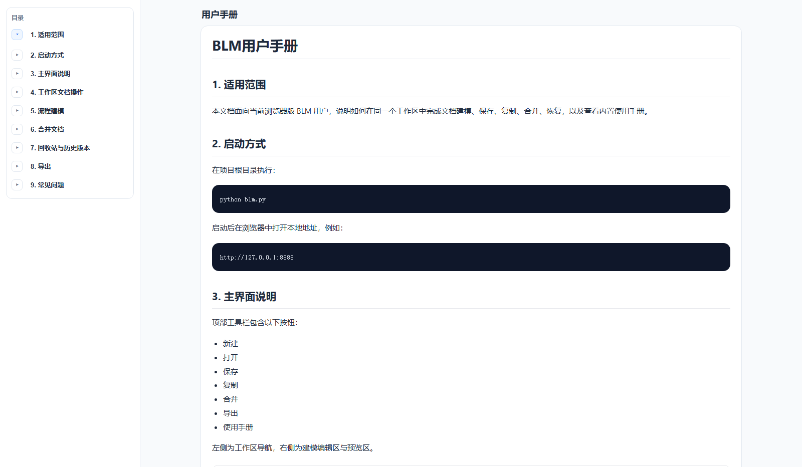

# BLM 设计文档

## 1. 文档目标

本文记录当前浏览器版 BLM 的产品边界、核心模块、工作区文档结构、流程图模型、附件机制、保存与合并机制。后续修改模型、存储、合并或恢复能力时，应同步更新本文，避免代码和设计认知脱节。

## 2. 当前产品边界

- BLM 是本地浏览器应用，由 Python HTTP 服务提供静态页面和 API。
- 一个工作区文档对应一份 JSON，保存时同步生成 Markdown。
- 前后端通过 HTTP 通信，前端在浏览器内持有当前编辑态，后端负责加载、保存、导出、合并、历史快照、回收站和附件落盘。
- 顶部左侧显示产品版本号，当前为 `v2.6`。
- 用户建模时关注业务概念，不需要看到或维护内部 ID。流程、实体、节点、分支、连线等内部标识由系统生成和迁移维护。

## 3. 模块职责

- `blm.py`：启动入口，读取环境变量并启动本地 HTTP 服务。
- `blm_core/server.py`：提供浏览器 API，包括工作区文档、附件、保存、合并、恢复和内置文档。
- `blm_core/collab.py`：负责实时协作会话、WebSocket snapshot 同步、HTTP 降级同步、seq/baseSeq 合并保护和协作 changelog。
- `blm_core/diagnostics.py`：负责结构化日志、滚动日志和最近日志读取。
- `blm_core/admin.py`：负责只读管理端，提供服务状态、协作连接、最近日志和诊断包。
- `blm_core/storage.py`：负责工作区读写、Markdown 导出、附件目录、历史快照、回收站、写锁和 revision 乐观锁。
- `blm_core/document.py`：负责文档标准化、旧字段迁移、隐藏 uid 补齐、流程图模型归一化。
- `blm_core/merge.py`：负责三方合并、两文档合并、冲突检测、冲突裁决和合并后一致性校验。
- `app/`：浏览器前端。`state.js` 管理状态，`render.js/domain.js/process.js/entity.js/preview.js/manual.js` 分别负责页面渲染、业务域、流程、实体、预览和使用手册。

## 4. 文档模型分层

BLM 的 JSON 不是关系型数据库，但可以借用“表 / 行 / 列”的理解来治理身份和合并：

- 表：顶层集合或嵌套集合，例如 `processes`、`entities`、`nodes`、`fields`。
- 行：集合里的一个对象，例如一个流程、一个实体、一个节点。
- 列：对象上的字段，例如 `name`、`note`、`type`、`roles`。
- 引用：行与行之间的关系，例如流程节点引用实体、业务构件引用实体、任务定义引用业务组件。

设计原则是：行级对象需要稳定身份；列级字段不单独引入身份。实体字段、表单字段这类“列”通常以字段名作为语义身份，不再要求用户维护额外 ID。

## 5. 身份设计

### 5.1 三类标识

- `uid`：系统内部主键，隐藏、全局唯一，用于识别同一个文档演化中的同一个对象。用户不可见、不可编辑。
- `id`：系统内部引用键，用于同一文档内连线、引用和兼容已有结构。用户不可见、不可编辑。
- `name`：用户可理解的业务名称，通常是中文。跨文档合并时，很多对象会以名称作为语义兜底匹配依据。

### 5.2 哪些对象需要 uid

行级业务对象需要 uid：

- 角色、阶段、阶段连线、阶段流程引用、阶段流程引用连线
- 流程、流程附件、附件版本
- 流程节点、流程分支、流程连线
- 用户操作步骤、编排任务、业务规则、表单、表单分组
- 实体、实体关系、实体状态节点、状态流转
- 规则、业务组件、业务构件、任务定义

列级对象原则上不需要独立 uid：

- 实体字段：字段名就是该实体内的语义身份。
- 表单字段：优先以字段名和所在分组识别。
- 简单枚举值、状态值、说明文本：作为所属对象的字段值处理。

当前代码里部分列级对象仍保留历史 uid，这是兼容实现，不作为长期产品概念暴露给用户。

### 5.3 名称作为业务语义身份

跨文档合并时，仅比较递增 ID 容易误判。例如两个文档里都有 `P1`，不代表是同一流程；两个流程 ID 不同但名称都是“入库预约申请”，在用户语义上反而更可能是同一流程。

因此合并识别顺序应是：

1. `uid` 相同：认为是同一个对象的不同版本，做字段级合并。
2. `uid` 不同但名称在同一语义范围内相同：认为可能是同一个业务对象，进入语义合并或冲突确认。
3. `uid` 不同且名称不同：作为新增对象插入。

语义范围必须明确，例如流程名称在同一文档内唯一，节点名称在同一流程内比较，实体字段名在同一实体内比较。

## 6. 合并策略

### 6.1 集中显式化

模型身份和合并策略必须集中体现在 `blm_core/model_strategy.py`。它是代码入口，也是人可以直接阅读的策略清单；涉及模型身份、ID 前缀、旧字段迁移、合并字段、语义匹配键的功能，都应从这里取规则，不能散落在页面代码或临时判断里。新增模型元素时，至少要更新：

- 文档集合列表：该元素属于哪个集合。
- 对象类型名称：用于冲突提示。
- 标量字段：字段不同如何判断冲突。
- 集合字段：是按集合去重，还是作为子对象递归合并。
- 语义匹配键：优先用 uid，缺失时用哪些业务字段匹配。
- 一致性校验：哪些重复、缺失引用、非法引用需要提示。

本次“业务组件 / 业务构件 / 任务定义”冲突暴露的问题，就是模型新增后合并策略没有同步扩展。后续把 `model_strategy.py` 作为模型变更的必改项：不更新策略，就不算完成模型新增。

### 6.2 合并层次

合并分两层：

- JSON 身份层：优先使用 uid 判断同一对象，适合同一文档多分支协作。
- 业务语义层：uid 不同但名称相同或引用范围相同时，按业务对象理解进行合并或提示。

这样既能支持同一文档并行编辑，也能支持“仓单作为保证金”和“国债作为保证金”这类相似业务文档合并。

### 6.3 冲突处理

- 同一 uid 的同一字段被两边改成不同值：展示字段级冲突，由用户选择左侧、右侧或自定义。
- uid 不同但语义名称相同、内容不同：展示同名对象冲突，由用户选择保留一侧或两者都保留。
- uid 不同且语义名称不同：自动合入。
- 引用缺失、重复关系、非法连线：作为校验问题提示，不静默吞掉。

## 7. 实时协作、自动同步与弱网降级

### 7.1 协作主链路

当前协作采用“结构化 JSON snapshot + 服务端 seq/baseSeq 串行裁决”的方案，不做完整 CRDT。

- 浏览器打开文档后，通过 WebSocket 加入 `/api/collab/ws`。
- 服务端为每个文档维护一个 `CollabSession`，包含当前文档、当前 `seq`、在线连接、最近 seq 快照。
- 前端编辑后进入自动同步队列，默认 5 秒防抖；用户点击“立即同步”时不等待防抖。
- 每次 snapshot 携带 `baseSeq`。如果 `baseSeq` 等于服务端当前 seq，直接接受；如果落后，则基于最近 seq 快照做轻量三方合并。
- 服务端是最终裁决者，旧客户端不能直接覆盖服务端新文档。

### 7.2 远端更新体验

- 远端更新不会频繁弹横幅。
- 如果当前用户正在编辑，远端 snapshot 暂存为“有更新待同步”，等待用户点击“立即同步”。
- “立即同步”同时承担两件事：推送本地修改，以及拉取/合并他人的修改。
- 顶栏协作状态可点击打开诊断弹窗，显示连接状态、seq、在线用户、待同步状态和最近活动。

### 7.3 HTTP 降级

WebSocket 不稳定时，前端会进入轮询降级模式：

- `GET /api/collab/poll?name=...&seq=...`：按 seq 拉取最新状态。
- `POST /api/collab/snapshot`：通过 HTTP 提交 snapshot。
- HTTP snapshot 复用同一套 `CollaborationManager` 串行合并逻辑，仍然使用 `baseSeq` 防覆盖。
- 降级模式实时性较低，但能保证“继续编辑 + 立即同步”有可用路径。

### 7.4 changelog 生命周期

`collab/changelog.jsonl` 是协作运行日志，不是业务文档正文：

- 产生：服务端处理 change/snapshot 后追加一行，记录 seq、用户、时间、baseSeq、变更模式等。
- 使用：服务端运行时主要使用内存 session；重启后先加载 `manifest.json`，再读取 changelog 恢复 seq 和未完全落盘的协作状态。
- 压缩：旧逻辑写入的完整大 snapshot 会在读取或追加时压缩，避免大文档恢复变慢。
- 删除影响：删除 changelog 不会让文档主体打不开，但会丢失近期协作重放能力；服务会从当前 `manifest.json` 重新开始协作 seq。

### 7.5 日志与管理端

- 结构化日志默认写入 `workspace/.logs/blm.log`，错误日志写入 `workspace/.logs/errors.log`。
- 日志记录服务启动、HTTP 请求、WebSocket join/leave/error/ping、snapshot、rebase、autosave 等关键事件。
- 管理端默认随主服务启动，默认端口 `8091`，可在 `blm.py` 顶部 `ADMIN_PORT` 修改，也可用 `BLM_ADMIN_PORT` 覆盖。
- 如果临时不需要管理端，可以设置 `BLM_ADMIN_PORT=0`。
- 管理端提供 `/api/status`、`/api/logs/recent`、`/api/diagnostics.zip`，用于跨网段断线排查。

### 7.6 与传统保存的关系

- 顶栏“立即同步”是当前主操作，不再强调旧式“保存”概念。
- 自动同步保障当前工作稿落盘；“归档版本”用于需求评审、上线基线等长期稳定快照。
- 普通历史记录用于近期恢复，不等同于正式版本。

## 8. 流程图模型

流程结构只定义三类元素：

- 节点：可办理的业务步骤。
- 分支：表达一个节点后的分流判断。
- 连线：表达开始、节点、分支、结束之间的流向和说明。

“开始”和“结束”不是可新增元素，只作为连线端点参与渲染。新增节点默认孤立，不自动生成连线。流程图可切换为摘要图和泳道图，两者使用同一套内部模型：

- 摘要图：按连线推导主路径和分支路径，省略分支菱形，仅展示大致过程。
- 泳道图：按节点角色投影到泳道，分支显示为菱形，支持拖拽节点、分支、开始、结束和连线说明。
- 多角色节点：摘要图只显示一次；泳道图可投影到多个泳道，并用共享节点样式提示。如果不同角色对应不同路径、不同任务或不同输入输出，应拆成多个单角色节点。

## 9. 业务组件模型

“能力单元”已统一改名为“业务组件”，英文模型字段使用 `businessComponent` / `businessComponents`。

业务组件不是流程的上级，而是流程背后的能力资产目录。当前组件下聚合：

- 实体
- 任务定义
- 业务构件
- 关联流程

业务构件和任务定义可以引用业务组件。流程、节点和编排任务也可以保留组件引用，用于目录聚合和资产追溯。

## 10. V3 应用编排模型

V3 应用编排的目标不是把 BLM 做成运行时引擎，而是把“流程节点、应用服务、构件任务、参数变量、技术承接”的设计关系沉淀到可审计 JSON 中，供流程应用平台和后续 Agent 生成工具继续承接。

### 10.1 概念边界

- 流程节点：表达某个角色在责任边界内连续做什么，可以引用应用服务，但不等同于 HTTP 接口。
- 应用服务：表达无状态接入服务对外暴露的接口，同时承接页面动作、流程动作和后端任务编排。
- 应用编排：表达一个应用服务内部如何串行组织多个构件任务，以及参数如何在步骤之间传递。
- 构件任务：表达业务构件对外提供的抽象能力，可以映射到聚合根方法、领域服务、HTTP 调用、查询服务或 Agent 生成物，但不绑定单一运行时。
- 技术承接：说明构件任务未来可能由哪类运行时承接，例如 FSM 内嵌领域服务、查询服务 HTTP、外部系统接口或 Agent 生成代码。

### 10.2 文档结构

V3 第一版使用以下主结构：

- `businessConstructs[]`：业务构件目录，承接组件下更细的业务能力单元。
- `taskDefinitions[]`：构件任务定义，支持结构化输入参数、输出参数和 `technicalHandover`。
- `services[]`：应用服务定义，支持 `method`、`path`、`desc`、`requestParams`、`responseParams`、`nodeRefs` 和 `orchestration`。
- `services[].orchestration.steps[]`：应用服务编排步骤，每个步骤引用一个构件任务，并维护稳定 `stepAlias`。
- `inputMapping`、`outputMapping`、`returnMapping`：分别表达步骤输入映射、步骤输出绑定和服务返回组装。

变量只在一次应用服务调用上下文中有效。第一版支持文本化变量路径：`request.*`、`context.*`、`step.<stepAlias>.*`、`const.*`、`return.*`。当前不做全局变量、跨应用服务变量池、表达式语言、复杂条件、循环、并行和补偿语义。

### 10.3 工作台职责

- 构件工作台维护业务构件、构件任务、任务输入输出和技术承接。
- 应用编排工作台维护应用服务、请求响应参数、编排步骤和参数变量映射。
- 流程工作台只回看节点关联的应用服务名称、方法、路径和说明，不暴露参数映射和技术承接细节。

这条边界很重要：产品经理在流程节点侧看“这个业务动作对应哪个服务入口”；技术经理在应用编排侧看“这个服务如何组织构件任务”；后端研发在构件侧看“这个构件任务将来如何落到代码或运行时”。

## 11. 附件与历史

- 附件长在流程上，并按“文档 / 流程 / 附件 / 版本”组织目录。
- 附件版本与文档版本独立。文档保存不复制大附件，避免大文件导致保存变慢。
- 删除附件进入统一附件回收位置，不与正文工作空间混放。
- 历史快照用于文档 JSON 和 Markdown 的恢复。格式大改时可以清空旧快照和回收站，避免旧格式反向污染当前模型。

## 12. 使用手册与预览

- 使用手册从 `docs/` 读取，入口位于顶部工具栏。
- 预览与建模视图应使用同一份标准化文档结构，避免“建模时正确、预览不一致”。
- 流程摘要图、泳道图、节点任务视图的渲染规则，应在建模区和预览区同步维护。

## 13. 文档维护约定

代码修改时，以下文档需要同步检查：

- `docs/BLM设计文档.md`：架构、模型、合并、保存、附件、恢复机制变化时更新。
- `docs/BLM用户手册.md`：界面文案、操作流程、按钮行为变化时更新。
- `docs/BLM测试用例.md`：新增功能、复杂交互、回归缺陷修复时更新。
- `docs/release/`：阶段性发布说明按日期追加。

截图可通过以下脚本刷新：

```bash
cd tools/e2e
npm run capture:docs
```




